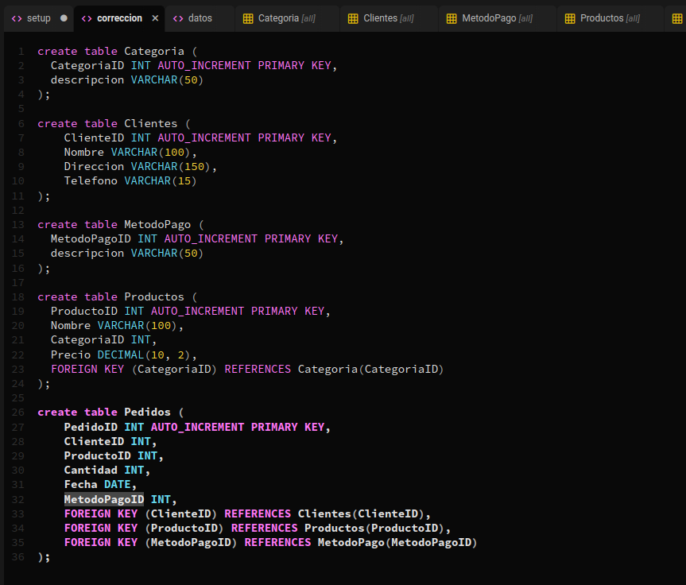
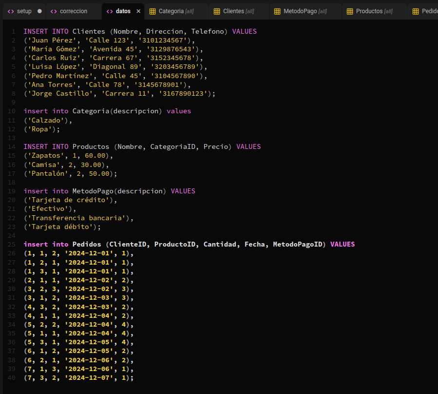
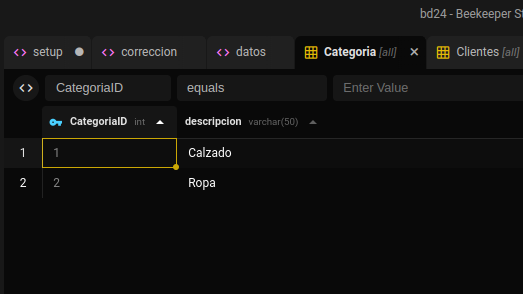
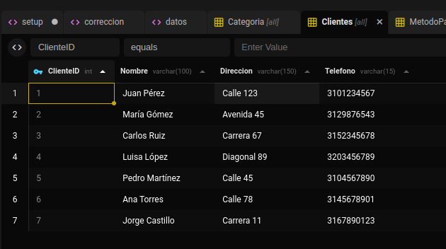
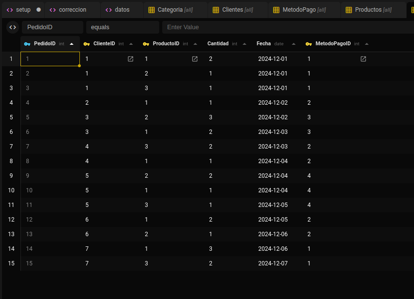
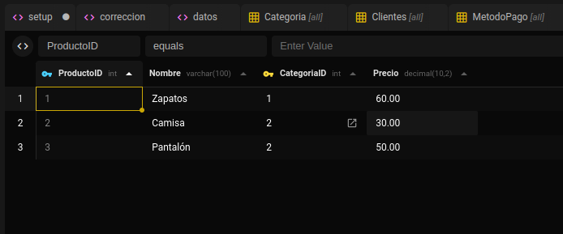

# Taller 3: Normalización de Bases de datos - Forma Normal

Camilo Esteban Paez - 1110450891

## Problemas Identificados

La tabla `productos` tiene las siguiente columnas: `PedidoID | ClienteID | ProductoID | Cantidad | Fecha | MetodoPago` , `PedidoID` es su PRIMARY KEY, `ClientID | ProductoID` son sus FOREIGN KEYS que permiten la no repetición de la información tanto de los clientes como del producto, `Cantidad` es un INT lo cual es tal-vez algo excesivo, `Fecha` es un DATE y `MetodoPago` es un VARCHAR(50) aquí también hay un problema.

### No relacionados a la normalización

- `Cantidad` tiene tipo INT firmado, al ser una tienda minorista no es necesario una cantidad posible tan grande, ademas no es posible pedir una cantidad negativa

### Relacionados con la normalizacion

- `MetodoPago` se comporta como un Enum pero esta definido como string, se puede extraer a otra tabla, compuesta por las columnas `MetodoPagoId | descripcion` o en su defecto usar el datatype `Enum`.
- `Categoria` se comporta como un Enum pero esta definido como string, se puede extraer a otra tabla, compuesta por las columnas `Categoria | descripcion` o en su defecto usar el datatype `Enum`.
- Direcciones podria extraerse a una tabla .

## Cambios realizados y nueva estructura

### Atomizacion

La base de datos esta suficientemente atomizada, se podria separar `Nombre` aunque no lo considero necesario.

### Eliminar valores multivaluados y repetidos

- Creacion tabla Categoria

`Categoria` pasara a residir en una tabla donde contará con una ID y una descripcion, esto permitira que se evite redundancia en la tabla `Productos`

```sql
create table Categoria (
  CategoriaID INT AUTO_INCREMENT PRIMARY KEY,
  descripcion VARCHAR(50)
);
```

- Creacion tabla MetodoPago

`MetodoPago` pasara a residir en una tabla donde contará con una ID y una descripcion, esto permitira que se evite redundancia en la tabla `MetodoPago`

```sql
create table MetodoPago (
  MetodoPagoID INT AUTO_INCREMENT PRIMARY KEY,
  descripcion VARCHAR(50)
);
```

- Nueva tabla Productos

```sql
create table Productos (
  ProductoID INT AUTO_INCREMENT PRIMARY KEY,
  Nombre VARCHAR(100),
  CategoriaID INT, -- <----- Nuevo Tipo
  Precio DECIMAL(10, 2),
  FOREIGN KEY (CategoriaID) REFERENCES Categoria(CategoriaID) -- <----- Nueva Foreign Key
);
```

- Nueva tabla Pedidos

```sql
create table Pedidos (
    PedidoID INT AUTO_INCREMENT PRIMARY KEY,
    ClienteID INT,
    ProductoID INT,
    Cantidad INT,
    Fecha DATE,
    MetodoPagoID INT, -- <----- Nuevo Tipo
    FOREIGN KEY (ClienteID) REFERENCES Clientes(ClienteID),
    FOREIGN KEY (ProductoID) REFERENCES Productos(ProductoID),
    FOREIGN KEY (MetodoPagoID) REFERENCES MetodoPago(MetodoPagoID) -- <----- Nueva Foreign Key
);
```

`Clientes` se mantiene con su misma estructura

```sql
create table Clientes (
    ClienteID INT AUTO_INCREMENT PRIMARY KEY,
    Nombre VARCHAR(100),
    Direccion VARCHAR(150),
    Telefono VARCHAR(15)
);
```

## Capturas










## Conclusiones

La normalizacion es esencial en las bases de datos relacionales ya que sacan partido de las propias caracteristicas de esta, permiten que ademas de eficiente se mantenga mantenible a lo largo del tiempo.
