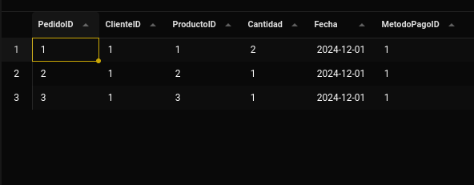

# Consultas Avanzadas con Algebra Relacional: Clientes, Productos y Pedidos

Camilo Esteban Paez - 1110450891

## 1. Identificacion de Clientes según Método de Pago

```sql
select distinct c.Nombre, c.Telefono from Clientes c
inner join Pedidos p
on p.ClienteID = c.ClienteID
inner join MetodoPago m
on m.MetodoPagoID = p.MetodoPagoID
where m.descripcion = 'Efectivo';
```


Ya normalizada la base es necesario realizar 2 inner joins (interseccion entre ambas tablas) para poder determinar el metodo de pago, Cliente y Pedidos luego MetodoPago y Pedidos, si conocieramos el ID de antemano seria mas veloz, se usa la keyword `distinct` para que se seleccionen unicamente las entradas que sean unicas y usando `where` discriminamos aquellas entradas que no equivalgan a 'Efectivo'.

## 2. Determinación de Productos No Solicitados

```sql
select p.Nombre from Productos p
left join Pedidos pe
on p.ProductoID = pe.ProductoID
where pe.ProductoID is null;
```


Es importante entender el uso de `left join` en esta consulta, si hicieramos un `inner join` perderiamos aquellos que productos que no han sido solicitados, justamente lo opuesto a lo que es requerido, por lo tanto el `left join` mantiene la informacion de la "izquierda" (Productos) y lo une con la informacion coincidente de la "derecha" (Pedidos) o `null`.

## 3. Renombramiento y Filtrado de Datos en "Pedidos"

```sql
select * from Pedidos as Compras
where Compras.Fecha = '2024-12-01';
```



La palabra clave `as` (alias) se utiliza para renombar de forma temporal una columna o tabla en este caso.

## 4. Análisis de Frecuencia de Productos Solicitados

```sql
select p.Nombre from Productos p
join Pedidos pe
on p.ProductoID = pe.ProductoID
group by Nombre
having sum(pe.Cantidad) > 1;
```


Para realizar esta consulta usamos `group by` que agrupa por nombre y nos permite realizar operacion como `SUM()` o `AVG()`, se usa `having` debido a que la implementacion de `where` no funciones con datos agrupados.

## 5. Clientes que Adquirieron Productos de una Categoría Especifica

```sql
select distinct c.Nombre from Clientes c
inner join Pedidos pe
on pe.ClienteID = c.ClienteID
inner join Productos pr
on pe.ProductoID = pr.ProductoID
inner join Categoria ca
on pr.CategoriaID = ca.CategoriaID
where ca.descripcion = 'Ropa';
```


¿Por que razon tantos `innner join`, al ya estar normalizada la base de datos `Productos` no contiene la descripcion y es necesario un join mas para obtener los resultados, primero se seleccionan los clientes que han hecho pedidos, luego sobre esos pedidos se obtiene la informacion del producto y por ultimo de esos productos se obtiene la informacion de su categoria, si es igual a 'Ropa' se selecciona el nombre.
