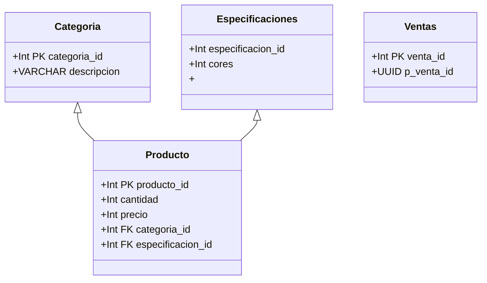

```mermaid
classDiagram    
    Categoria <|-- Producto
    Especificaciones <|-- Producto
    class Producto{
        +Int PK producto_id
        +Int cantidad
        +Int precio
        +Int FK categoria_id
        +Int FK especificacion_id
    }

    class Categoria {
        +Int PK categoria_id
        +VARCHAR descripcion
    }

    class Especificaciones {
        +Int especificacion_id
        +Int cores
        +
    }
    
    class Ventas {
        +Int PK venta_id
        +UUID p_venta_id
    }
```
